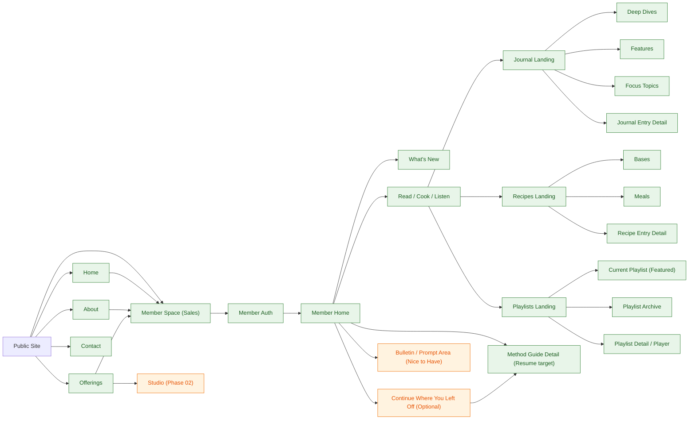

# TRS Member + Public Site Map

## Purpose
- Define the full site map including public marketing pages, member portal pages, and deferred Phase 02 pages.
- Clarify navigation paths, conversion paths, and page relationships for design/build sequencing.

## Phase Scope
- **MVP (Phase 5):** Public core + Member portal foundation
- **Deferred (Phase 02):** Studio page and related booking/logistics expansion

## Sitemap Diagram

## Navigation Model
- **Public nav (MVP):** Home, About, Offerings, Member Space, Contact, Log In
- **Member nav (MVP target):** Home, Journal, Recipes, Playlists, Method (if exposed in nav)
- **Member Home internal blocks:** What's New, Read/Cook/Listen previews, optional Continue, optional Bulletin

## Relationship Notes
- `Member Space (Sales)` is the conversion bridge from public site into member auth and portal usage.
- `Member Home` is a re-entry/orientation surface, not a dense content feed.
- `Journal`, `Recipes`, and `Playlists` are recurring engagement pillars and should be reachable in one click from member home.
- `Method Guide Detail` is a destination tied to resume behavior from member home.

## Build Priority Sequence
1. Public conversion flow: Home -> Member Space -> Auth
2. Member Home orientation blocks: What's New + Read/Cook/Listen
3. Landing pages: Journal, Recipes, Playlists
4. Optional enhancements: Continue Where You Left Off, Bulletin/Prompt
5. Phase 02: Studio public page and booking details

## Open Architecture Decisions
- Confirm whether `Method` is top-level in member nav or accessed contextually from Home + Member Space.
- Confirm if `Continue Where You Left Off` is technically feasible in the selected member stack.
- Confirm whether playlist archive entries use embedded players, external links, or both.

## Change Log
- **2026-03-10:** Added expanded sitemap for member-side architecture and cross-site connections
